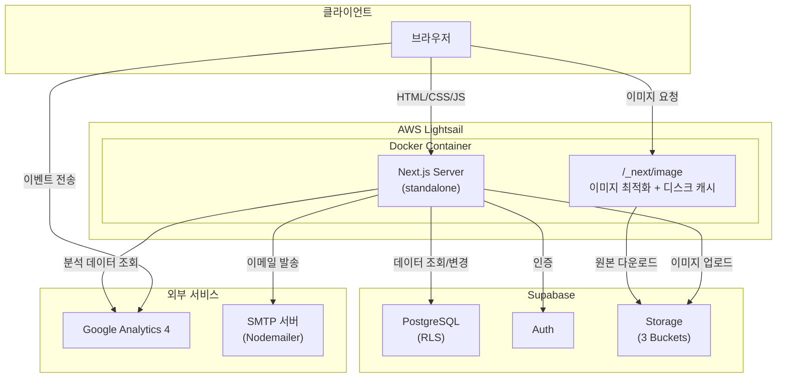

# 청소클라쓰

**전주 청소·이사 전문 업체 청소클라쓰 공식 웹사이트**

 

 

[**운영 사이트 바로가기**](https://www.cleaningclass.co.kr)

 

---

## 목차

- [개요](#개요)
- [기술 스택](#기술-스택)
- [시스템 아키텍처](#시스템-아키텍처)
- [주요 기능](#주요-기능)
  - [공개 사이트](#01--공개-사이트)
  - [관리자 대시보드](#02--관리자-대시보드)
- [릴리즈 노트](#릴리즈-노트)

---

## 개요

본 프로젝트는 해당 업체의 **공식 마케팅 웹사이트** 및 **사내 운영 시스템**으로, 마케팅용 공개 웹 사이트 및 콘텐츠·통계 관리용 관리자 대시보드를 Next.js 애플리케이션으로 제공합니다.

 

---

## 기술 스택

**`Core`**

**`Backend & Data`**

**`Analytics`**

**`Testing & Quality`**

**`Deploy`**

 

---

## 시스템 아키텍처

 

---

## 주요 기능

### `01` · 공개 사이트

<table>
<tr>
<td width="50%" valign="top">

#### 랜딩 & 브랜드
메인 페이지 히어로·서비스·리뷰 등 소개 섹션으로 구성하며, 각 페이지 별 서비스 소개·가격표·견적문의폼·FAQ 페이지를 제공합니다.

</td>
<td width="50%" valign="top">

#### 서비스 소개
청소·이사 카테고리별 상세 페이지에서 Before·After 이미지 및 포커스 포인트 크롭 기능을 통한 마케팅용 이미지 관리 기능을 제공합니다.

</td>
</tr>
<tr>
<td valign="top">

#### 작업 후기
업체에서 기존 운영 중인 네이버 블로그 리뷰 링크 연계 및 등록 기능을 제공합니다.

</td>
<td valign="top">

#### 고객 리뷰
작업 완료 후 이용 고객이 별도 로그인 없이 익명 리뷰를 남길 수 있는 기능을 제공합니다.

</td>
</tr>
<tr>
<td valign="top">

#### 견적 문의
청소·이사 유형 별 견적 문의 폼을 제공하며, 담당자 이메일로 전송하는 기능을 제공합니다.

</td>
<td valign="top">

#### 정책 및 RSS
개인정보처리방침, 이용약관, 도움말 FAQ 페이지를 제공합니다.

</td>
</tr>
</table>

 

---

### `02` 관리자 대시보드

<table>
<tr>
<td width="50%" valign="top">

#### 유입 통계 대시보드
방문자 유입 경로, 전환 이벤트, 기간별 추이 등 운영 지표를 집계해 시각화합니다.

</td>
<td width="50%" valign="top">

#### 마케팅 데이터 수정 기능
서비스 소개, 가격표, 외부 블로그 후기, 고객 리뷰, FAQ, 업체 정보 등 사이트에 노출되는 콘텐츠를 직접 편집할 수 있습니다.

</td>
</tr>
</table>

 

---

## 릴리즈 노트

| 버전 | 날짜 | 주요 내용 | 노트 |
|------|------|-----------|------|
| [v1.1.0](docs/releases/v1.1.0.md) | 2026-06-07 | 견적폼 청소/이사 분리 + 가격표 자동 연동, HEIC 변환·정책 v20260607 갱신·GA4/Clarity 제거 | [→](docs/releases/v1.1.0.md) |
| [v1.0.1](docs/releases/v1.0.1.md) | 2026-05-19 | 고객 리뷰 평점 카운트업 애니메이션 회귀 수정 + 단위 테스트 100% 커버리지·검증 게이트 강화 | [→](docs/releases/v1.0.1.md) |
| [v1.0.0](docs/releases/v1.0.0.md) | 2026-05-19 | 청소클라쓰 공식 사이트 첫 출시 — 공개 사이트(서비스/리뷰/가격표/견적) + 관리자 대시보드(GA4 연동 + CRUD) | [→](docs/releases/v1.0.0.md) |

 

---

© 2026 NomadLabs. All rights reserved.

